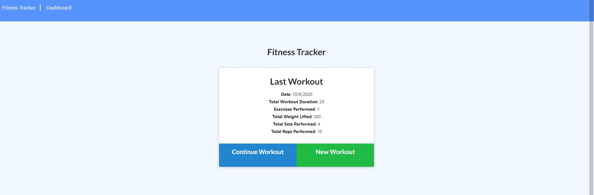
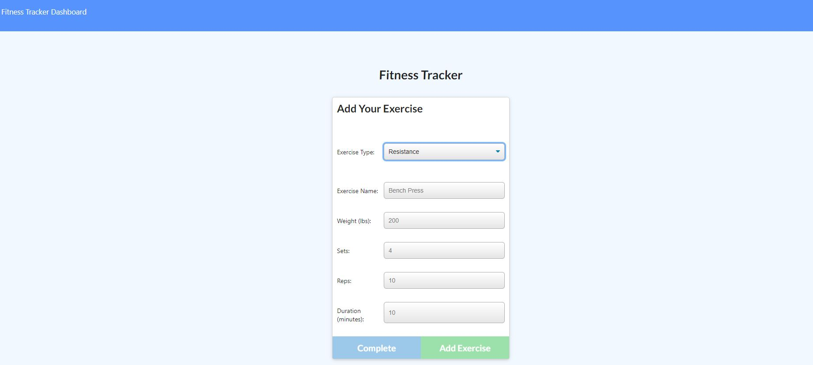
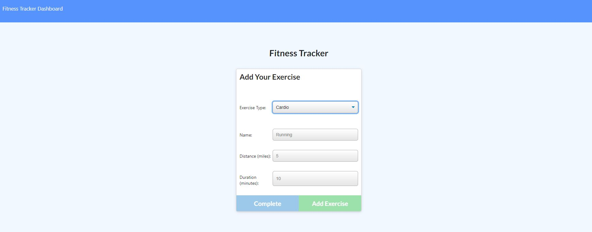
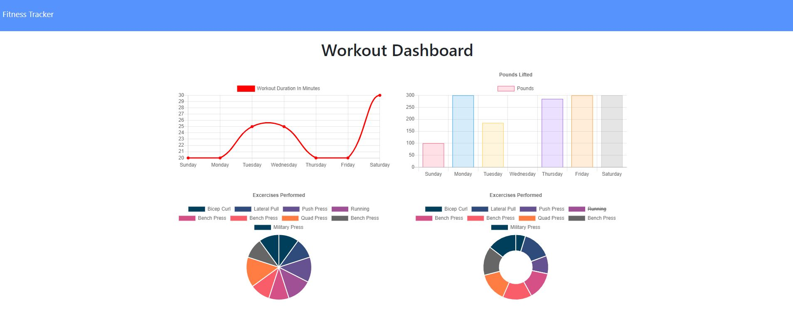
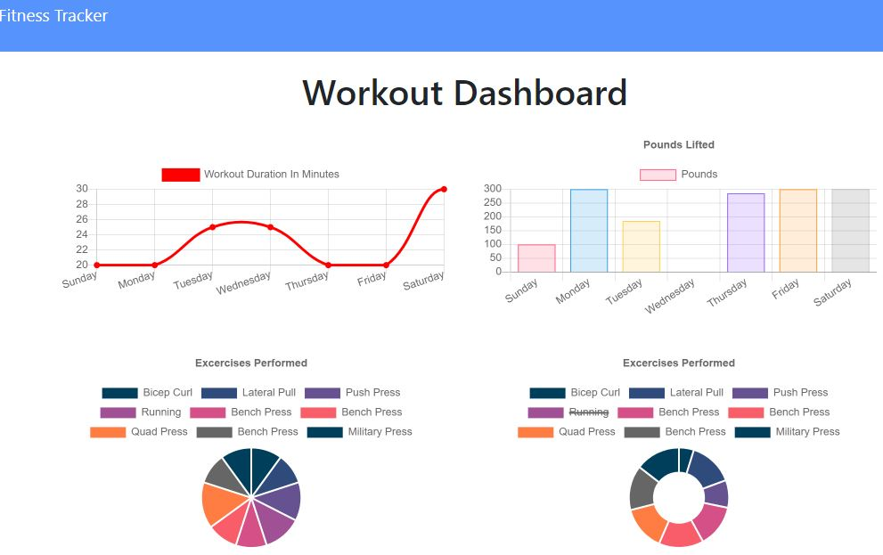

  # Fitness Tracker Web App  
  
   
  
  ## Table of Contents
  
  - [Description](#description)
  - [Installation](#installation)
  - [Usage](#usage)
  - [License](#license)
  - [Contribution](#contribution)
  - [Test](#test)
  - [Authors](#authors)
  - [Questions](#questions)
  
   
  
  ## Description  
  
  This is a Mongoose ODM based fitness tracker application. The backend is powered by MongoDB and Node.js with express middleware. This application enables a user to track her fitness activities, update exising fitness regime, view the dashboard of summary of the progress and activity history. The application was successfully deployed on Heroku. This app will enable a user to view create and track daily workouts. The user will also be able to log multiple exercises in a workout on a given day. The user should also be able to track the name, type, weight, sets, reps, and duration of exercise. If the exercise is a cardio exercise, the user should be able to track their distance traveled.
  

## Business Context

A consumer will reach their fitness goals more quickly when they track their workout progress.
  
  ## Installation
  
  Clone the code to your github repository and use 'npm install' command in the terminal to install dependencies. Run 'npm run seed' to add the initial records to the database. Run the program using: 'npm run start'.
  
  ## Usage
  
Please clone the project to your local repo, install the dependencies, start the app by running npm start. You can also use the hosted application on Heroku. 

 
 
 
 
  
  ## License
  
  This project is licensed under:
  
   
  
  MIT
  
  ## Contribution
  
  Please contact me on my email [Email Address](anyaegbufrancis@gmail.com) or fork the repository from my github account: [Github Profile](https://github.com/anyaegbufrancis). Please make a pull request and we can review the updates, corrections or bug fixes together.
  
  ## Test
  
  Please click the below to see the feature demo on Heroku: https://ffitness-tracker.herokuapp.com/
  
  
  
  ## Authors
  
  The author of this project is: 
  
  Francis Anyaegbu. 
  
  To contribute, please refer to [Contributors](#contributors) section.
  
  ## Questions
  
  For questions, concerns, comments or your valued inputs regargind this README.md generator, kindly go to my Github page or contact me on my email address below:
    
  - [Github Profile](https://github.com/anyaegbufrancis)
                    
  - [Email Address](anyaegbufrancis@gmail.com)
